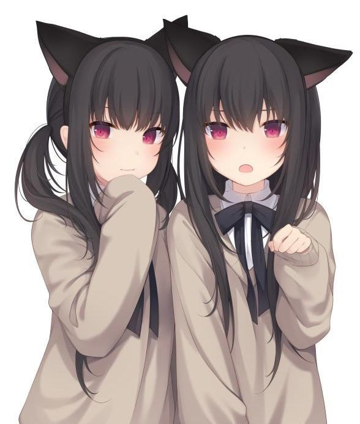

### Hi there 👋

<!--
**MiccoMeow/MiccoMeow** is a ✨ _special_ ✨ repository because its `README.md` (this file) appears on your GitHub profile.

Here are some ideas to get you started:

- 🔭 I’m currently working on ...
- 🌱 I’m currently learning ...
- 👯 I’m looking to collaborate on ...
- 🤔 I’m looking for help with ...
- 💬 Ask me about ...
- 📫 How to reach me: ...
- 😄 Pronouns: ...
- ⚡ Fun fact: ...
-->

Meow，🐱，🐈

已分项重组n次 日语名「香風音子/かふうねこ」　英文名Micco

喵喵主义万岁！
Long live the meowism！
  这个是咱的<a href="https://github.com/MiccoMeow/Scratching_board">猫抓板</a>
- 📫 How to reach me: t.me/hyangpung 或 mailto:micco@gmx.us
- 😄 Pronouns: she/her  &&  meow/miao
- ⚡ Fun fact: 
